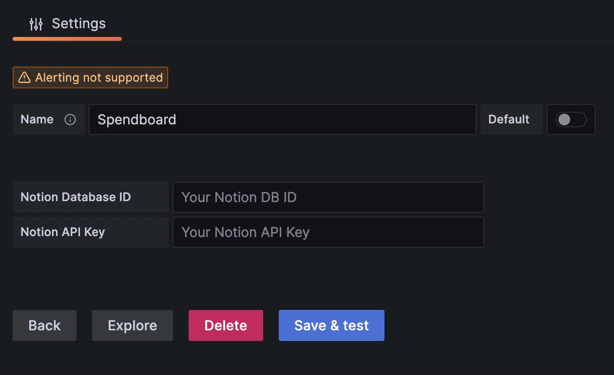
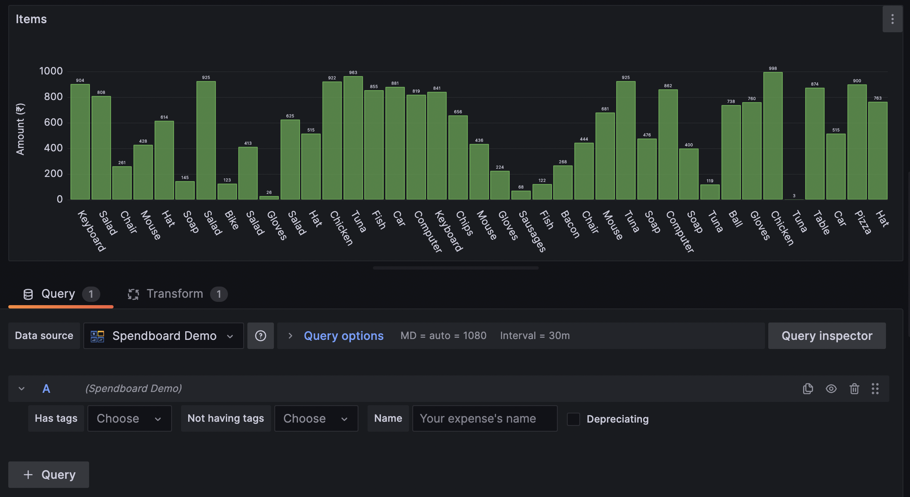
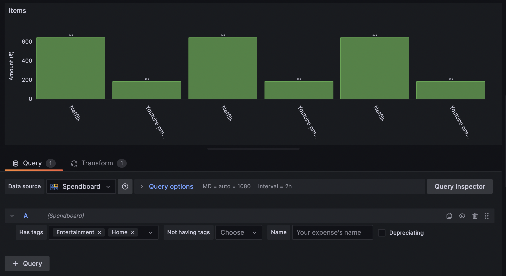
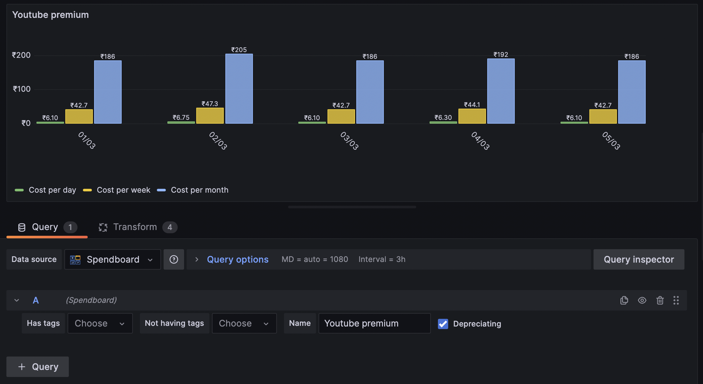

<!-- This README file is going to be the one displayed on the Grafana.com website for your plugin -->

# Spendboard

A datasource for your expenses on notion.

## Features

- Get timeseries data of your expenses from a Notion database.
- Filter expenses based on tags
- Get your expenses in daily-amortised form
- Comes with a dashboard having preset panels

## Installation

1. Create a Notion database with the required schema. Copythe database ID from the URL.
2. Create a Notion integration and copy the integration secret.
3. In the plugin setup page, enter your Notion database ID and Notion integration secret.

4. Optionally, you can download a sample dashboard that demonstrates several of the possible panels that can be created.

## Usage

When setting up a panel, you can query the Spendboard datasource through the query editor.

- By default, each query will return all expenses from Notion within the given time range in descending order.

- You can filter for expenses having/not having certain tags and a certain name.

- You can also transform the expenses to a daily-amortised form.

